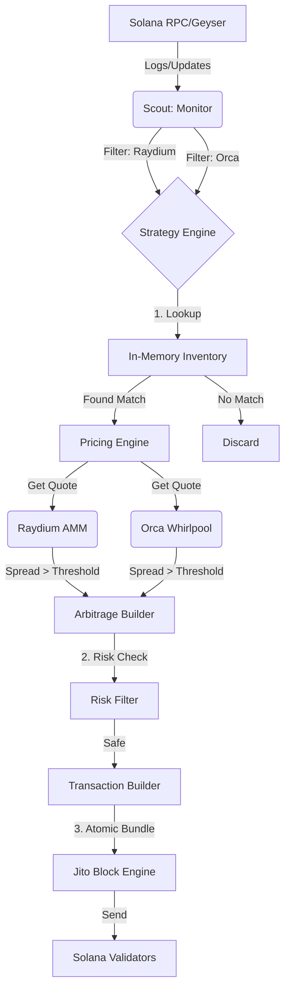

# Scavenger 系统架构 (System Architecture)

本文档详细描述了 Scavenger MEV 机器人的技术架构、核心逻辑映射及数据流向。

## 1. 架构概览 (Overview)

Scavenger 采用 **Rust 异步架构 (Tokio)**，设计目标为毫秒级响应 Solana 链上事件。系统分为三个核心层级：

1.  **侦察层 (Scout Layer)**: 负责监听、过滤和解析链上事件（WebSocket/gRPC）。
2.  **策略层 (Strategy Layer)**: 负责状态维护、机会识别、风险检查和交易构建。
3.  **执行层 (Execution Layer)**: 负责原子化交易打包和 Jito Bundle 发送。

## 2. 核心逻辑映射 (Core Logic Map)

### 🔍 侦察系统 (Scout System)

| 逻辑模块 | 关键功能 | 文件路径 | 代码位置/结构 | 备注 |
| :--- | :--- | :--- | :--- | :--- |
| **Monitor** | 多路日志监听 | `scavenger/src/scout/monitor.rs` | `start_monitoring` | 同时订阅 Raydium (`Initialize2`) 和 Orca (`InitializePool`) |
| **Decoder (Ray)** | Raydium 解析 | `scavenger/src/scout/raydium.rs` | `parse_log_for_new_pool` | 提取 Pool ID, Token Mints |
| **Decoder (Orca)** | Orca 解析 | `scavenger/src/scout/orca.rs` | `parse_log_for_event` | 提取 Whirlpool ID, Token Mints |
| **RPC Client** | 链上数据拉取 | `scavenger/src/scout/mod.rs` | `RpcClient::new` | 使用 Non-blocking Client 异步拉取交易详情 |

### 🧠 策略引擎 (Strategy Engine)

| 逻辑模块 | 关键功能 | 文件路径 | 代码位置/结构 | 备注 |
| :--- | :--- | :--- | :--- | :--- |
| **Inventory** | 全网代币索引 | *(Pending Phase 2.5)* | `MemoryCache` | 内存中维护 `HashMap<TokenMint, Vec<PoolAddress>>` |
| **Pricing (AMM)** | CPMM 价格计算 | `scavenger/src/amm/raydium_v4.rs` | `calculate_price` | $x \cdot y = k$ 模型 |
| **Pricing (CLMM)** | Whirlpool 报价 | *(Pending Phase 2.5)* | `TickMath` | 集中流动性 Tick Array 遍历 |
| **Engine** | 双向比价主控 | `scavenger/src/strategy/engine.rs` | `process_event` | 收到事件 -> 查缓存 -> 比价 -> 触发 |
| **Risk** | 风险过滤器 | `scavenger/src/strategy/risk.rs` | `check_token_risk` | 检查 Mint/Freeze Authority, Honeypot |

### ⚙️ 执行与基础设施 (Infrastructure)

| 逻辑模块 | 关键功能 | 文件路径 | 代码位置/结构 | 备注 |
| :--- | :--- | :--- | :--- | :--- |
| **Swap Builder** | 指令构建 | `scavenger/src/strategy/swap.rs` | `swap_instruction` | 构建 Raydium/Orca Swap IX |
| **Jito Client** | Bundle 发送 | `scavenger/src/scout/mod.rs` | `JitoClient` | gRPC 连接 Block Engine (目前暂时禁用) |
| **Config** | 配置管理 | `scavenger/src/config.rs` | `AppConfig` | 加载 `config.toml` |
| **Wallet** | 密钥管理 | `scavenger/src/main.rs` | `load_keypair` | 管理交易钱包和鉴权钱包 |

---

## 3. 数据流向 (Data Flow)

## 4. 技术栈选型 (Tech Stack)

*   **Language**: Rust (性能与安全性)
*   **Async Runtime**: Tokio (高并发处理)
*   **RPC**: Solana Client (Non-blocking), Jito Geyser (Planned)
*   **Serialization**: Borsh (Solana 标准), Serde
*   **Math**: `uint` (U256 高精度计算), `rust_decimal`

## 5. 关键算法与模型

1.  **Constant Product Market Maker (CPMM)**: 用于 Raydium V4/V5。
    *   公式: $(x_{old} + x_{in}) \cdot (y_{old} - y_{out}) = k$
2.  **Concentrated Liquidity Market Maker (CLMM)**: 用于 Orca Whirlpool / Raydium CLMM。
    *   需要实时维护 Tick Bitmap 和 Tick Arrays。
    *   价格计算涉及跨 Tick 的流动性聚合。
3.  **Jito Bundle**:
    *   特性: 原子性 (All-or-Nothing)，抗 MEV (不会被三明治攻击)，无 Revert 成本 (模拟失败不扣费)。
