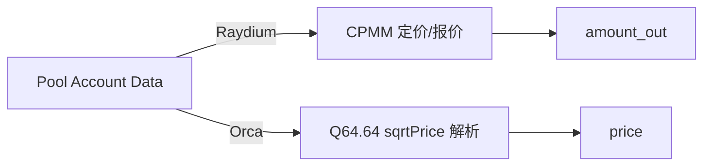

# AMM：定价与数学模型

本项目把“定价”尽量放在本地完成：即使只拿到池子账户的原始 data，也能在本地快速计算价格/报价，减少对 RPC 模拟的依赖，并降低延迟。

## 1. 模块功能说明

- CPMM（Raydium）：常数乘积定价与报价计算（`x*y=k`）。
- CLMM（Orca Whirlpool）：从 `sqrt_price(Q64.64)` 推导价格，支持 tick/流动性字段读取（当前仅做价格读取，完整 swap 需要 tick array）。
- Quote：通过 RPC 获取必要账户数据（AMM state + vault balance），本地计算 amount_out。

对应源码：

- CPMM：`../../scavenger/src/amm/math.rs`
- Raydium AMM 状态：`../../scavenger/src/amm/raydium_v4.rs`
- Orca Whirlpool 价格解析：`../../scavenger/src/amm/orca_whirlpool.rs`
- Raydium Quote：`../../scavenger/src/core/quote.rs`



## 2. 技术实现细节

### 2.1 Raydium（CPMM）核心

CPMM（含费率）常用整数公式：

- `amount_in_with_fee = amount_in * (fee_den - fee_num)`
- `amount_out = (amount_in_with_fee * reserve_out) / (reserve_in * fee_den + amount_in_with_fee)`

本项目使用 `U256` 避免 u128 溢出，见 `amm/math.rs`。

### 2.2 Orca Whirlpool（CLMM）核心

Orca Whirlpool 的 `sqrt_price` 用 Q64.64 表示（固定点数）：

- `price = (sqrt_price / 2^64)^2`

本项目为了避免定义完整的 Whirlpool 账户结构（字段很大且包含 reward infos），采用“按 offset 切片”的方式从账户 data 中读出关键字段：

- liquidity: `data[49..65]`
- sqrt_price: `data[65..81]`
- tick: `data[81..85]`

见 `amm/orca_whirlpool.rs` 的 `decode_current_price`。

## 3. 关键算法和数据结构

- 高精度整数：`U256`（Rust `uint` 宏生成）
- 本地报价：`core/quote.rs` 在获取 vault balance 后调用 `amm/math.rs` 计算

## 4. 性能优化点

- 本地定价优先：用账户 data 直接算价格，避免 `simulateTransaction` 这类重 RPC。
- 缓存与批量读取（后续可做）：
  - 对常用 vault balance 做短 TTL 缓存
  - 对同一 slot 内多个报价做 batch RPC（`getMultipleAccounts`）

## 5. 可运行示例（CPMM 报价 + Q64.64 价格转换）

```python
def get_amount_out(amount_in: int, reserve_in: int, reserve_out: int, fee_num: int, fee_den: int) -> int:
    # CPMM（含费）整数实现：适合做快速报价/预估
    amount_in_with_fee = amount_in * (fee_den - fee_num)
    numerator = amount_in_with_fee * reserve_out
    denominator = reserve_in * fee_den + amount_in_with_fee
    return numerator // denominator

def sqrt_price_x64_to_price(sqrt_price_x64: int) -> float:
    # Orca Whirlpool: price = (sqrt_price / 2^64)^2
    q64 = float(1 << 64)
    p = float(sqrt_price_x64) / q64
    return p * p

def demo():
    out = get_amount_out(amount_in=100, reserve_in=1000, reserve_out=1000, fee_num=25, fee_den=10000)
    print("cpmm amount_out:", out)
    print("price(sqrt=2^64):", sqrt_price_x64_to_price(1 << 64))

if __name__ == "__main__":
    demo()
```

## 6. 相关篇

- 上游（监听产生的 data）：[Scout_交易监听与解析.md](./Scout_交易监听与解析.md)
- 下游（套利策略如何用价格）：[StrategyArb_跨DEX套利策略.md](./StrategyArb_跨DEX套利策略.md)
