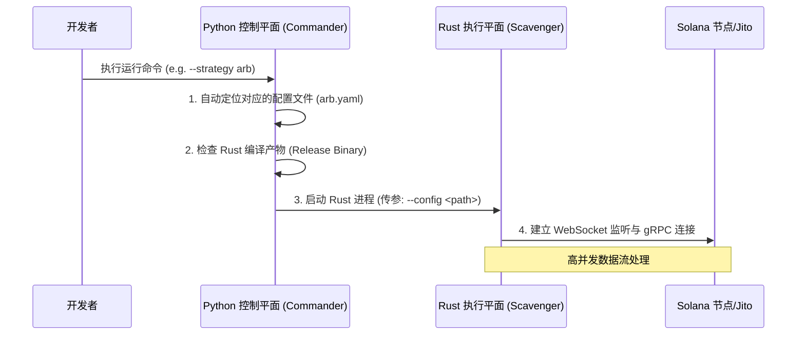

# 策略引擎的“大脑”：解耦控制平面与执行平面的架构实践

在构建 Solana MEV 系统时，开发者往往面临一个经典权衡：**Rust 的速度** vs **Python 的灵活性**。

为了在“黑暗森林”中既能像猎豹一样爆发（执行性能），又能像狐狸一样灵活切换策略（调度灵活性），我们采用了**双层架构设计**：由 Python 构建的**控制平面 (Control Plane)** 负责策略编排与配置管理，由 Rust 构建的**执行平面 (Data Plane)** 负责高并发数据处理。

本文将拆解这一架构背后的逻辑，以及如何通过 Python 实现一个工业级的策略调度引擎。

---

## 1. 为什么需要“控制平面”？

如果将 MEV 机器人比作一辆赛车，Rust 执行引擎就是那台能够承受高转速的 V12 发动机，而 Python 控制平面则是驾驶舱里的仪表盘和挡把。

### 1.1 解耦配置与逻辑
MEV 策略（如套利、狙击、清算）涉及大量的参数：RPC 节点地址、Jito Tip 额度、白名单代币、最大滑点控制等。
*   **痛点：** 如果将这些配置硬编码在 Rust 中，每次微调参数都需要重新编译。在瞬息万变的市场中，几十秒的编译时间足以让机会溜走。
*   **方案：** Python 负责读取 YAML/JSON 配置，预处理逻辑后，以命令行参数或环境变量的形式将其注入 Rust 进程。

### 1.2 统一入口与多策略管理
一个成熟的系统往往同时运行多种策略。
*   **Arb（套利）：** 长期运行，监听主流池子。
*   **Sniper（狙击）：** 临时启动，针对新发代币。
*   **Control Plane** 作为一个统一调度器（Commander），可以根据市场行情一键启动不同的策略实例，实现“策略即插件”。

---

## 2. 架构概览：跨语言边界与接口

系统的核心交互遵循**“单向推导，进程隔离”**的原则：



*   **控制平面职责：** 环境检查、路径自动推导、进程生命周期管理、优雅退出（Graceful Shutdown）。
*   **执行平面职责：** 账户状态解析、本地定价计算、交易构造、Bundle 提交。

---

## 3. 技术实现细节

### 3.1 路径自适应与编译回退
在生产环境下，我们直接运行预编译好的 Rust Release 二进制文件以获取最快启动速度。但在开发调试阶段，我们希望它能自动检测。

**调度逻辑伪代码：**
1.  检查 `target/release/` 下是否存在二进制。
2.  若存在，直接 `subprocess.spawn` 运行。
3.  若不存在，回退至 `cargo run --release`。

### 3.2 环境隔离与工作目录约束
MEV 机器人通常需要读取本地钱包（Keypair）和缓存文件。为了保证安全性与一致性，控制平面必须严格约束 Rust 进程的**当前工作目录 (CWD)**。这能有效防止不同环境（Docker vs 物理机）下的路径漂移。

---

## 4. 工业级调度器代码示例

下面是一个精简后的 Python 控制平面实现示例。它演示了如何管理子进程并动态注入配置。

```python
import argparse
import os
import subprocess
import sys
from pathlib import Path

class BotCommander:
    def __init__(self, strategy: str, config_name: str):
        self.strategy = strategy
        self.config_path = Path(f"configs/{config_name}.yaml").absolute()
        self.root_dir = Path(__file__).parent.parent  # 项目根目录
        self.engine_dir = self.root_dir / "engine_rust" # Rust 源码目录

    def _find_binary(self) -> list:
        """选择执行命令：优先使用 release 二进制，否则回退到 cargo run"""
        release_bin = self.engine_dir / "target" / "release" / "mev_engine"
        
        if release_bin.exists():
            print(f"[*] 使用预编译二进制: {release_bin}")
            return [str(release_bin)]
        
        print("[!] 未发现 release 二进制，尝试通过 cargo run 启动...")
        return ["cargo", "run", "--release", "--bin", "mev_engine", "--"]

    def run(self):
        # 组装完整的执行命令
        base_cmd = self._find_binary()
        args = [
            "--strategy", self.strategy,
            "--config", str(self.config_path)
        ]
        full_cmd = base_cmd + args

        print(f"[*] 启动策略 [{self.strategy}]...")
        try:
            # 使用 subprocess 启动执行平面，并锁定工作目录
            subprocess.run(full_cmd, cwd=self.engine_dir, check=True)
        except KeyboardInterrupt:
            print("\n[!] 收到停止信号，正在关闭机器人...")
        except subprocess.CalledProcessError as e:
            print(f"[X] 执行引擎崩溃，退出码: {e.returncode}")

if __name__ == "__main__":
    parser = argparse.ArgumentParser(description="Solana MEV 控制平面")
    parser.add_argument("--strategy", default="arbitrage", help="选择运行策略")
    parser.add_argument("--config", default="mainnet_alpha", help="配置文件名")
    
    cmd_args = parser.parse_args()
    commander = BotCommander(cmd_args.strategy, cmd_args.config)
    commander.run()
```

---

## 5. 性能优化与运维思考

在实际生产中，控制平面的设计还需要考虑以下几点：

1.  **预热（Warm-up）：** 在正式启动套利监听前，控制平面可以先运行一个简单的 Python 脚本检查 RPC 节点的延迟和钱包余额，确保“万无一失”再把接力棒交给 Rust。
2.  **日志分流：** Rust 侧输出结构化 JSON 日志，Python 侧负责收集并将其推送至远程监控（如 Loki 或 Telegram Bot）。
3.  **热更新策略：** 对于不需要修改代码逻辑的“黑名单代币”，可以利用文件监听（Watcher）机制。当 Python 修改了配置文件，Rust 侧通过 `notify` 库实时重新加载，无需重启进程。

## 6. 下一步预告

有了控制平面作为保障，我们可以放心地进入 Rust 的世界。下一篇文章中，我们将剖析 **“库存驱动监听（Inventory-Driven Monitoring）”**——如何用 Rust 建立一套全网代币与流动性池的高效索引，在海量交易流中瞬间锁定制胜机会。

---
*本文由 Levi.eth 撰写。在 Solana MEV 的世界里，架构的一小步优化，往往就是收益的一大步跨越。*