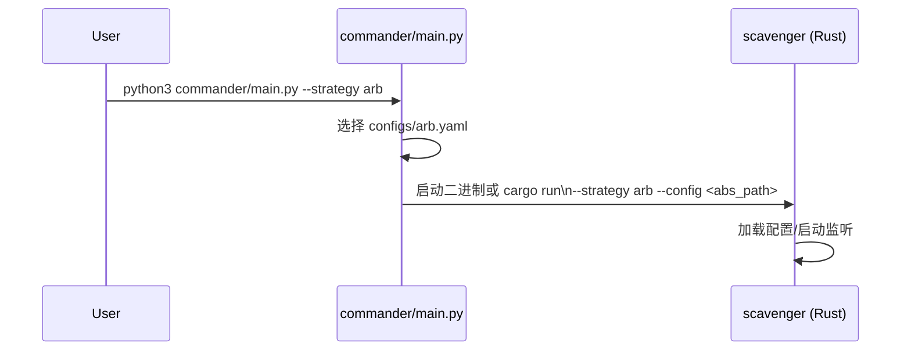

# Control Plane：策略调度与配置

本文描述 Python 控制平面（Control Plane）在本项目中的角色：选择策略、加载配置、启动 Rust 二进制，并解释其与 Rust 数据平面的边界与接口。

## 1. 模块功能说明

- 统一入口：用一个命令启动不同策略（arb/sniper）。
- 配置选择：按策略名选择对应 YAML 配置文件。
- 启动方式自适应：若存在 release 二进制则直接运行，否则回退 `cargo run`。
- 工作目录约束：在 `scavenger/` 目录运行，保证相对路径（钱包文件、缓存文件等）可解析。

对应源码：`../../commander/main.py`

## 2. 技术实现细节

关键流程：

1. 解析 CLI 参数：`--strategy`
2. 推导路径：`project_root`、`scavenger_dir`、`config_path`
3. 选择执行命令：优先 `target/release/scavenger`，否则 `cargo run --release`
4. `subprocess.run(..., cwd=scavenger_dir, check=True)`

Rust 侧对应入口：

- `../../scavenger/src/main.rs`：`--strategy` 与 `--config` 参数解析



## 3. 关键算法与数据结构

本模块以“流程编排”为主，没有复杂算法；关键数据结构是“策略名 → 配置路径”的映射。

## 4. 性能优化点

- 避免每次都 `cargo run`：预编译 release 二进制（或用 Docker 镜像）能显著降低启动耗时。
- 配置路径尽量使用绝对路径：避免在不同执行环境（Docker/宿主机/CI）下路径漂移。

## 5. 可运行示例（最小可执行调度器）

下面是一个“可运行且可验证”的最小调度器示例：它不依赖本仓库，但完整演示“策略选择 → 组装命令 → 执行/回退”的控制逻辑。

```python
import argparse
import os
import subprocess
import sys
from typing import List

def build_cmd(scavenger_dir: str, strategy: str, config_path: str) -> List[str]:
    # 优先使用 release 二进制；不存在则回退 cargo run
    rust_binary = os.path.join(scavenger_dir, "target", "release", "scavenger")
    if os.path.exists(rust_binary):
        return [rust_binary, "--strategy", strategy, "--config", config_path]
    return ["cargo", "run", "--release", "--bin", "scavenger", "--", "--strategy", strategy, "--config", config_path]

def main() -> int:
    p = argparse.ArgumentParser()
    p.add_argument("--strategy", default="arb")
    p.add_argument("--scavenger-dir", default=os.getcwd())
    p.add_argument("--config", required=True)
    args = p.parse_args()

    # 组装命令并在 scavenger 目录执行，确保相对路径可用
    cmd = build_cmd(args.scavenger_dir, args.strategy, args.config)
    print("Executing:", " ".join(cmd))
    try:
        subprocess.run(cmd, cwd=args.scavenger_dir, check=True)
        return 0
    except subprocess.CalledProcessError as e:
        print("Process failed:", e.returncode)
        return e.returncode

if __name__ == "__main__":
    raise SystemExit(main())
```

## 6. 相关篇

- 总览：[SolanaMEV_技术解析.md](./SolanaMEV_技术解析.md)
- Rust 入口与配置：[Inventory_全网代币索引.md](./Inventory_全网代币索引.md)
