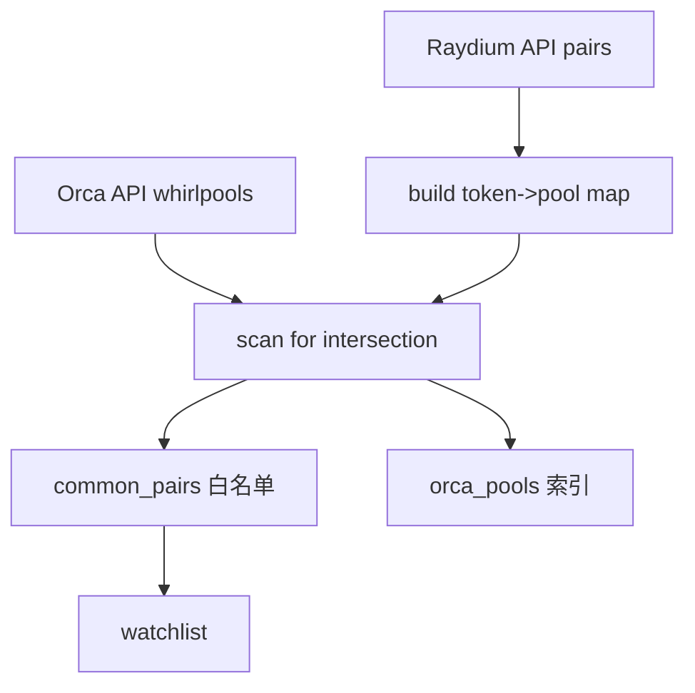

# Inventory：全网代币索引

Inventory 是本项目“库存驱动监听（Inventory-Driven Monitoring）”的核心：它将链上大量池子信息先离线/冷启动聚合成内存索引，用于生成监听白名单、缩小监听面并加速机会识别。

## 1. 模块功能说明

- 拉取池列表：从 Raydium 与 Orca 的 REST API 拉取池信息。
- 生成交集白名单：找出在多个 DEX 同时存在流动性的 token/pool 组合（套利候选）。
- 生成监听列表：把候选池地址汇总为 watchlist，供监听模块订阅 account updates。
- 运行时更新：监听到新池事件后可增量写入索引（兼容 sniper/扩展）。

对应源码：

- Inventory 数据结构：`../../scavenger/src/state.rs`
- API 拉取：`../../scavenger/src/scout/api.rs`
- Orca 冷启动全量索引：`../../scavenger/src/scout/orca.rs` 的 `load_all_whirlpools`



## 2. 技术实现细节

### 2.1 关键数据结构：DashMap + Arc

源码中 Inventory 的核心字段：

- `orca_pools: Arc<DashMap<Pubkey, Vec<Pubkey>>>`
- `common_pairs: Arc<DashMap<Pubkey, ArbitragePair>>`

设计动机：

- DashMap：高并发读写，避免在高频事件处理时被全局锁拖慢。
- Arc：跨 tokio 任务共享，降低 clone 成本（共享引用计数）。

### 2.2 白名单生成策略（当前实现）

`Inventory::load_from_api()` 的关键逻辑（概念）：

1. 并发拉取 `fetch_raydium_pools()` 与 `fetch_orca_pools()`。
2. 用 Raydium pools 构建 `token_a -> pool_address` 的映射（当前实现关注 token_a）。
3. 遍历 Orca pools，若 `token_a` 在 Raydium 映射中出现，则认为是“共有套利对”，写入 `common_pairs`。
4. 同时把 Orca pool 写入 `orca_pools`（供 sniper 或扩展使用）。

注意：这是一种“启发式”的交集策略，工程上通常还会加入：

- 识别 base/quote（避免 token_a/token_b 方向导致覆盖或误判）
- 对同一 token 的多个 fee tier/多个池做优选或保留多条候选
- 结合流动性/TVL/交易量过滤，减小 watchlist

## 3. 关键算法与数据结构

### 3.1 交集算法（Intersection）

- 时间复杂度：`O(|Ray| + |Orca|)`  
  - Raydium 构建哈希表 `O(|Ray|)`  
  - Orca 遍历查表 `O(|Orca|)`  
- 空间复杂度：`O(|Ray| + |Common|)`

### 3.2 Watchlist 生成

- `get_watch_list()` 线性扫描 `common_pairs`，把 Raydium 与 Orca pool 地址收集到数组。

## 4. 性能优化点

- API 缓存：`fetch_raydium_pools()` 将结果写入本地缓存文件（运行时在 `scavenger/` 目录），避免 API 不稳定导致冷启动失败。
  - 源码：`../../scavenger/src/scout/api.rs`
- 订阅上限：监听端对订阅账户数量做了上限限制（避免公用 RPC/WSS 直接超限）。
  - 源码：`../../scavenger/src/scout/monitor.rs` 中 `max_subs = 50.min(total)`
- 后续可优化：
  - 分片订阅与轮询：按 token/池分片，动态调整订阅集合
  - 维护“热度”指标：把更活跃/更可能出价差的池保留在实时监听集合

## 5. 可运行示例（构建交集白名单 + 生成监听列表）

该示例用标准库构建“token→pool”的交集索引，可直接运行：

```python
from dataclasses import dataclass
from typing import Dict, List, Optional, Tuple

@dataclass(frozen=True)
class PoolInfo:
    address: str
    token_a: str
    token_b: str

@dataclass(frozen=True)
class ArbitragePair:
    token_mint: str
    raydium_pool: str
    orca_pool: Optional[str]

def load_from_api_mock() -> Tuple[List[PoolInfo], List[PoolInfo]]:
    # 这里用 mock 数据模拟 Raydium/Orca API 返回
    ray = [
        PoolInfo("ray_sol_usdc", "SOL", "USDC"),
        PoolInfo("ray_bonk_sol", "BONK", "SOL"),
        PoolInfo("ray_jup_sol", "JUP", "SOL"),
    ]
    orca = [
        PoolInfo("orca_sol_usdc", "SOL", "USDC"),
        PoolInfo("orca_jup_sol", "JUP", "SOL"),
        PoolInfo("orca_wif_sol", "WIF", "SOL"),
    ]
    return ray, orca

def build_common_pairs(ray: List[PoolInfo], orca: List[PoolInfo]) -> Dict[str, ArbitragePair]:
    # 用 Raydium 先构建 token_a -> pool 的索引，便于 O(1) 查找
    ray_map: Dict[str, str] = {p.token_a: p.address for p in ray}
    common: Dict[str, ArbitragePair] = {}
    for p in orca:
        # 交集：Orca 的 token_a 在 Raydium 里也出现，则记录为候选套利对
        if p.token_a in ray_map:
            common[p.token_a] = ArbitragePair(
                token_mint=p.token_a,
                raydium_pool=ray_map[p.token_a],
                orca_pool=p.address,
            )
    return common

def get_watch_list(common: Dict[str, ArbitragePair]) -> List[str]:
    # 把候选池地址汇总成监听列表
    wl: List[str] = []
    for pair in common.values():
        wl.append(pair.raydium_pool)
        if pair.orca_pool:
            wl.append(pair.orca_pool)
    return wl

if __name__ == "__main__":
    ray, orca = load_from_api_mock()
    common = build_common_pairs(ray, orca)
    print("common pairs:", common)
    print("watch list:", get_watch_list(common))
```

## 6. 相关篇

- 上游（调度/启动）：[ControlPlane_策略调度与配置.md](./ControlPlane_策略调度与配置.md)
- 下游（监听）：[Scout_交易监听与解析.md](./Scout_交易监听与解析.md)
