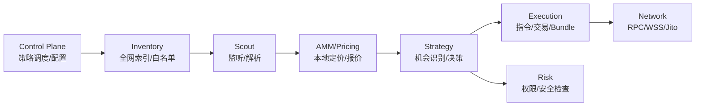

# Project：模块拆分总览

本文给出本仓库 Solana MEV 项目的“逻辑模块划分”，并把每个模块映射到源码目录与对应的实现文档，方便作为项目级分解文档在博客中引用。

## 1. 模块划分（逻辑视角）

模块边界的核心原则：

- “慢路径”尽量异步化：RPC 拉取、交易解析、网络请求都在后台任务或并发流程中完成。
- “热路径”尽量本地化：价格计算/报价优先本地完成，减少链上模拟依赖。
- “监听面”尽量缩小：先做库存索引，后做精确订阅，降低无效事件。

## 2. 模块到源码的映射（工程视角）

### 2.1 Control Plane（Python）

- 作用：策略选择、配置选择、启动 Rust 二进制
- 入口：`commander/main.py`
- 文档：[ControlPlane_策略调度与配置.md](./ControlPlane_策略调度与配置.md)

### 2.2 Inventory（数据层）

- 作用：构建候选套利 token/pool 白名单与监听列表
- 入口：`scavenger/src/state.rs`、`scavenger/src/scout/api.rs`
- 文档：[Inventory_全网代币索引.md](./Inventory_全网代币索引.md)

### 2.3 Scout（侦察层）

- 作用：WebSocket 监听（logs/account updates）、解析与事件分发
- 入口：`scavenger/src/scout/mod.rs`、`scavenger/src/scout/monitor.rs`
- 文档：[Scout_交易监听与解析.md](./Scout_交易监听与解析.md)

### 2.4 AMM / Pricing（定价层）

- 作用：Raydium CPMM 报价、本地数学模型；Orca Whirlpool 价格解析（Q64.64）
- 入口：`scavenger/src/amm/*`、`scavenger/src/core/quote.rs`
- 文档：[AMM_定价与数学模型.md](./AMM_定价与数学模型.md)

### 2.5 Strategy（策略层）

- 作用：机会识别、价差判定、方向选择、调用执行层
- 入口：`scavenger/src/strategies/arb.rs`、`scavenger/src/strategies/sniper.rs`
- 文档：[StrategyArb_跨DEX套利策略.md](./StrategyArb_跨DEX套利策略.md)

### 2.6 Execution（执行层）

- 作用：构造 swap 指令、组装原子交易、发送 bundle
- 入口：`scavenger/src/core/{swap,arbitrage,jito_http}.rs`
- 文档：[Execution_原子交易与JitoBundle.md](./Execution_原子交易与JitoBundle.md)

### 2.7 Risk（风控层）

- 作用：代币权限与可交易性检查（freeze/mint authority）
- 入口：`scavenger/src/core/risk.rs`
- 文档：[Risk_风控与安全检查.md](./Risk_风控与安全检查.md)

## 3. 推荐阅读顺序

- 总览：[SolanaMEV_技术解析.md](./SolanaMEV_技术解析.md)
- 模块拆分（本文）
- Inventory → Scout → AMM → Strategy → Execution → Risk（按闭环顺序）

