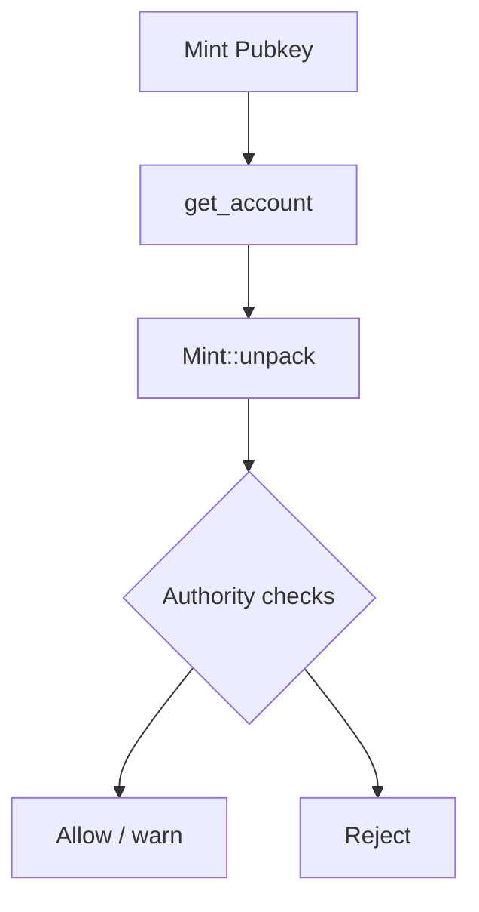

# Risk：风控与安全检查

MEV 策略的风险不仅来自“价格波动”，还来自“资产本身的权限与可交易性”。例如新币存在 Freeze Authority，可能导致资产无法转出，从而让套利/狙击直接变成资金黑洞。

## 1. 模块功能说明

- 对目标代币 Mint 进行安全检查：
  - Freeze Authority 是否为 None
  - Mint Authority 是否已经丢弃（严格策略可要求为 None）
  - 读取 supply/decimals 作为风险参考



对应源码：

- `../../scavenger/src/core/risk.rs`

## 2. 技术实现细节

`check_token_risk` 的执行步骤：

1. RPC 拉取 mint 账户：`get_account(mint)`
2. 用 SPL Token 的 `Mint::unpack` 解析数据
3. 根据 authority 字段判断风险，并输出 `RiskReport`

在策略上更常见的扩展检查包括：

- 是否可转账（transfer hook、黑名单等机制）
- LP 是否锁仓、是否可移除流动性
- 合约是否可升级（upgrade authority）
- 交易税/反 MEV 机制（部分代币会在转账/交换时扣税）

## 3. 关键算法和数据结构

- `RiskReport`：统一承载检查结果，便于策略层做“硬拒绝/软警告”。

## 4. 性能优化点

- 缓存：对同一 mint 的风险报告做缓存（TTL 例如 10~60 分钟），避免高频重复 RPC。
- 批量：对一组 mint 用 `getMultipleAccounts` 批量拉取。

## 5. 可运行示例（最小风险检查器）

该示例用纯 Python 数据结构模拟 mint 权限检查逻辑，可直接运行：

```python
from dataclasses import dataclass
from typing import List, Optional

@dataclass(frozen=True)
class MintMeta:
    mint_authority: Optional[str]
    freeze_authority: Optional[str]
    supply: int
    decimals: int

@dataclass(frozen=True)
class RiskReport:
    is_safe: bool
    reasons: List[str]

def check_mint_risk(m: MintMeta, strict: bool = False) -> RiskReport:
    # strict=True 时把 mint_authority 也视作硬风险
    reasons: List[str] = []
    safe = True
    if m.freeze_authority is not None:
        safe = False
        reasons.append("freeze_authority is set")
    if strict and m.mint_authority is not None:
        safe = False
        reasons.append("mint_authority is set (strict)")
    if m.decimals > 12:
        reasons.append("unusual decimals")
    return RiskReport(is_safe=safe, reasons=reasons)

if __name__ == "__main__":
    demo = MintMeta(mint_authority="AUTH", freeze_authority=None, supply=10_000_000, decimals=6)
    print(check_mint_risk(demo, strict=False))
    print(check_mint_risk(demo, strict=True))
```

## 6. 相关篇

- 上游（策略执行前的 gating）：[StrategyArb_跨DEX套利策略.md](./StrategyArb_跨DEX套利策略.md)
