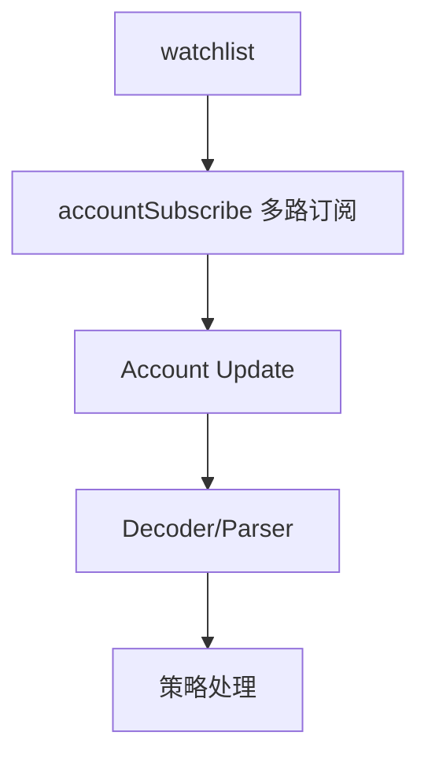

# Scout：交易监听与解析

Scout 负责把“链上发生了什么”转化为“策略可用的结构化事件”，并尽量以低延迟、低无效事件的方式把信号送入策略层。

## 1. 模块功能说明

- 连接 WebSocket：建立 Solana PubSub 长连接。
- 监听两类信号源：
  - 新池/事件：`logsSubscribe`（sniper 模式）
  - 池状态变化：`accountSubscribe`（arb 模式，白名单池）
- 多路复用：将多个订阅流合并，统一在事件循环中处理。
- 解码与补全：对日志命中事件，通过 RPC 拉取交易并解析出 pool/token 信息（当前实现为简化版）。



对应源码：

- Scout 启动与线程模型：`../../scavenger/src/scout/mod.rs`
- 监听器：`../../scavenger/src/scout/monitor.rs`
- Raydium 解析：`../../scavenger/src/scout/raydium.rs`
- Orca 解析：`../../scavenger/src/scout/orca.rs`

## 2. 技术实现细节

### 2.1 两种监听模式

#### Arb 模式（accountSubscribe）

流程：

1. 启动时调用 `Inventory::load_from_api()` 构建白名单。
2. `Inventory::get_watch_list()` 得到池地址列表。
3. 对每个池地址调用 `account_subscribe(pubkey, None)`。
4. 合并 streams（`futures::stream::select_all`）并循环读取更新。
5. 将账户 data 解码为 bytes，交给策略层处理（目前直接 `tokio::spawn` 调用 `strategies::arb::process_account_update`）。

这种方式适用于“已知池集合的高频状态变化”，能显著减少 logs 过滤与无效 RPC 拉取。

#### Sniper 模式（logsSubscribe）

流程：

1. 对 Raydium/Orca program id 做 `logs_subscribe(Mentions([...]))`
2. 在日志中寻找“初始化池”的信号（当前实现为简化过滤）
3. 命中后通过 RPC `get_transaction_with_config` 拉取完整交易并解析账户列表
4. 调用 sniper 策略（当前 `sniper.rs` 为占位）

这种方式适用于“捕捉新池创建/关键指令发生”的场景。

### 2.2 低延迟的关键点

- 尽量避免“命中日志后再做大量同步 RPC”：采用并发任务 `tokio::spawn`，把慢路径从主 loop 中移走。
- 对固定池集合优先使用 `accountSubscribe`：信号更直接，省去交易解析开销。
- 把“结构化解析”前置：例如 Orca 直接从账户 data 提取 `sqrt_price` 与 `tick`（见 `amm/orca_whirlpool.rs`）。

## 3. 关键算法和数据结构

- 事件流合并：`select_all(streams)` 将多个订阅流 merge 为一个 stream。
- 事件到策略的路由：
  - 当前实现：监听模块直接调用策略函数（耦合但简单）。
  - 更常见的工程方式：使用 `tokio::mpsc` 做解耦（monitor 产出事件，strategy engine 消费事件）。

## 4. 性能优化点

- 订阅上限：避免公用 RPC 被封禁或断流（当前硬编码 top 50，后续可做动态调度）。
- 降噪：Raydium logs 只周期性打印（每 50 条），避免 IO 成为瓶颈。
- 冷启动索引并行：`main.rs` 中对 `load_all_whirlpools` 使用后台任务启动，降低启动阻塞。

## 5. 可运行示例（多路事件流合并 + 异步处理）

该示例用 `asyncio` 模拟“多个 account update 流合并 + 分发处理”，可直接运行：

```python
import asyncio
import random
from dataclasses import dataclass
from typing import AsyncIterator

@dataclass(frozen=True)
class AccountUpdate:
    pool: str
    price: float

async def fake_pool_stream(pool: str) -> AsyncIterator[AccountUpdate]:
    # 模拟某个池子的价格更新流（对应 accountSubscribe 推送）
    price = random.uniform(0.9, 1.1)
    while True:
        await asyncio.sleep(random.uniform(0.05, 0.2))
        price *= random.uniform(0.999, 1.001)
        yield AccountUpdate(pool=pool, price=price)

async def merge_streams(*streams: AsyncIterator[AccountUpdate]) -> AsyncIterator[AccountUpdate]:
    # 多路流合并：把多个生产者写入同一个队列，消费者按到达顺序取出
    q: asyncio.Queue = asyncio.Queue()

    async def pump(s: AsyncIterator[AccountUpdate]):
        async for item in s:
            await q.put(item)

    tasks = [asyncio.create_task(pump(s)) for s in streams]
    try:
        while True:
            yield await q.get()
    finally:
        for t in tasks:
            t.cancel()

async def handle_update(u: AccountUpdate):
    # 这里对应“把事件交给策略层处理”的异步任务
    await asyncio.sleep(0)
    print(f"[update] pool={u.pool} price={u.price:.6f}")

async def main():
    s1 = fake_pool_stream("ray_pool")
    s2 = fake_pool_stream("orca_pool")
    async for u in merge_streams(s1, s2):
        asyncio.create_task(handle_update(u))

if __name__ == "__main__":
    asyncio.run(main())
```

## 6. 相关篇

- 上游（白名单来源）：[Inventory_全网代币索引.md](./Inventory_全网代币索引.md)
- 下游（定价与计算）：[AMM_定价与数学模型.md](./AMM_定价与数学模型.md)
