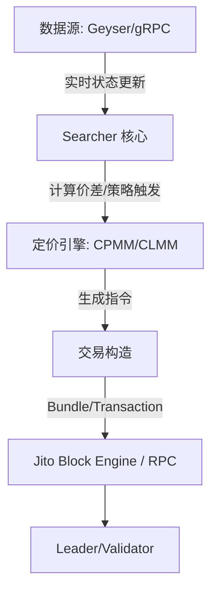

# 深度解析 Solana MEV：高并发引擎下的“黑暗森林”法则与架构实现

在加密货币的世界里，MEV（最大可提取价值）常被喻为区块链的“黑暗森林”。随着 Solana 生态的爆发，这片森林变得愈发幽深且复杂。相比于以太坊成熟的 PBS（提议者-构建者分离）模型，Solana 凭借其独特的并行执行、极高的吞吐量以及不到 400ms 的 Slot 时间，为 MEV 探索者（Searchers）提供了一套截然不同的博弈规则。

本文作为 **Solana MEV 深度探索系列** 的开篇，将从核心概念、交易管线、技术架构以及工程落地四个维度，拆解 Solana MEV 的底层逻辑。

---

## 1. 重新定义 MEV：Solana 语境下的博弈

### 1.1 什么是 MEV？
MEV 指的是区块生产者（在 Solana 中称为 Leader）通过在其产生的区块内对交易进行**包含、排除或重新排序**，所能获得的额外收益。

在 Solana 的高性能环境下，MEV 不仅仅是“抢跑”，它更多地体现为一种**极致的延迟竞争与资本效率的博弈**：

*   **抢跑（Front-running）：** 在目标交易前成交。
*   **夹子（Sandwich Attack）：** 针对滑点控制较松的交易，在前后分别插入买单和卖单。
*   **回跑（Back-running）：** 在大额成交产生价格冲击后，立即跟进执行套利。
*   **跨 DEX 套利（Spatial Arbitrage）：** 捕捉 Raydium、Orca、Meteora 等不同流动性池之间的价差。
*   **清算（Liquidation）：** 在借贷协议因价格波动触发清算瞬间，抢夺清算奖励。

### 1.2 Solana 与以太坊的“显著差异”
Solana 的机制决定了它没有以太坊那种“经典的公开 Mempool（内存池）”。

1.  **无全局公开内存池：** 交易通过 QUIC 协议直接发送给 Leader。普通用户很难像在以太坊上那样，通过观察 Mempool 来精准实施夹子攻击。
2.  **确定性调度：** Solana 采用并行处理引擎 Sealevel。如果两笔交易涉及的账户不重叠，它们会并行执行，排序的意义在并行环境下被弱化。
3.  **极低延迟：** 400ms 的出块时间要求 Searcher 的策略逻辑必须在毫秒级内完成：感知状态 -> 计算价差 -> 构造交易 -> 发送。

---

## 2. 纵览 Solana 交易管线：MEV 的插入点

要捕获 MEV，必须理解一笔交易是如何在 Solana 网络中“流动”的：

1.  **交易构造：** 客户端指定指令（Instruction）、账户映射及签名。
2.  **TPU 接收：** 交易通过 QUIC 协议到达当前的 Leader（TPU 单元）。
3.  **流水线排序：** Leader 在其 Slot 内对交易进行排序。此时，**Priority Fee（优先费）** 和 **Jito Tip（小费）** 是决定排序的关键。
4.  **Banking Stage：** 执行交易，修改账户状态。
5.  **最终确认：** 经过三个确认阶段（Processed -> Confirmed -> Finalized）。

**MEV 捕获的关键点：** 
*   **感知速度：** 越快拿到账户状态更新（Account Update），就越早能发现机会。
*   **包含确定性：** 如何确保你的套利交易不被丢弃？这催生了类似 Jito 这样的第三方 Bundle 机制。

---

## 3. 技术框架：Searcher 的核心组件

在工程实现上，一个成熟的 Solana MEV 系统通常包含以下模块：



*   **State Feed（状态感知）：** 弃用传统的 WebSocket `logsSubscribe`，高性能系统通常接入 **Geyser 插件** 或 gRPC 流，以获得微秒级的账户变更推送。
*   **Searcher（策略大脑）：** 负责解析数据流，识别池子变动，执行风控模型。
*   **Block Engine（包含机制）：** 类似于以太坊的 Flashbots。在 Solana 上，**Jito-Solana** 是主流，它允许 Searcher 将多笔交易打包成 **Bundle**，并支付 Tip 给 Validator，确保原子性执行（要么全部成功，要么全部失败）。

---

## 4. 工程实现：分层架构设计

为了兼顾开发效率与执行性能，主流架构倾向于采用 **“控制平面 + 数据平面”** 的分层设计。

### 4.1 分层逻辑
*   **控制平面 (Control Plane)：** 通常使用 **Python** 或 Go 编写。负责高层逻辑、策略调度、配置文件管理、API 交互以及监控看板。
*   **数据平面 (Data Plane)：** 必须使用 **Rust**。负责极速的数据解析（如解析复杂的 Raydium/Orca 状态）、本地定价计算、签名构造以及基于 Jito 的交易发送。

### 4.2 核心算法：库存驱动监听 (Inventory-Driven Monitoring)
盲目监听全网所有池子会导致严重的网络拥塞和计算浪费。高效的系统会：
1.  **冷启动扫描：** 从 Raydium 和 Orca 的 API 拉取所有流动性池，根据资产质量、TVL 筛选出潜在套利对。
2.  **白名单生成：** 仅对筛选出的池子账户进行订阅。
3.  **本地状态镜像：** 在内存中维护一份这些池子的轻量级镜像（Reserves、SqrtPrice 等），无需频繁请求 RPC。

---

## 5. 核心代码逻辑演示（伪代码）

### 5.1 跨协议定价差异计算
不同协议的定价逻辑不同。例如 Raydium 的 CPMM 与 Orca 的 CLMM：

```python
# 常数乘积公式 (CPMM) 模拟输出计算
def calculate_cpmm_out(amount_in, res_in, res_out, fee_rate=0.0025):
    amount_with_fee = amount_in * (1 - fee_rate)
    return (amount_with_fee * res_out) / (res_in + amount_with_fee)

# 集中流动性 (CLMM) 的价格解析 (Q64.64 格式)
def sqrt_price_x64_to_price(sqrt_price_x64):
    price = (sqrt_price_x64 / (2**64)) ** 2
    return price
```

### 5.2 监听与触发逻辑
在 Rust 数据平面中，系统会监听特定的账户变动：

```rust
// 伪代码：监听到账户更新后的核心处理流
match account_update {
    RaydiumUpdate(data) => {
        let new_price = parse_raydium_reserves(data);
        inventory.update_price("SOL/USDC", Protocol::Raydium, new_price);
        check_arbitrage_opportunity("SOL/USDC");
    },
    OrcaUpdate(data) => {
        let new_price = parse_orca_sqrt_price(data);
        inventory.update_price("SOL/USDC", Protocol::Orca, new_price);
        check_arbitrage_opportunity("SOL/USDC");
    }
}
```

---

## 6. 总结：未来的竞争高地

Solana MEV 已经从早期的“简单的脚本编写”进化到了“全方位的工程竞赛”：
1.  **网络优化：** 谁的服务器离 Leader 更近，谁的 QUIC 连接配置更优。
2.  **算法精度：** 对复杂 CLMM（集中流动性）池子的瞬时定价精度。
3.  **资金效率：** 能够在多条路径中寻找最优路径，并结合 Jito Bundle 规避交易失败带来的手续费损耗。

在接下来的系列文章中，我们将深入探讨 **如何构建全网代币索引 (Inventory)**、**如何优化 gRPC 数据解析速度** 以及 **Jito Bundle 的原子化实战**。

欢迎来到 Solana 的黑暗森林，愿你的 Bundle 永远被包含。

--- 

*本文为 [Your Project Name/Blog Series] 的技术分享系列，持续关注以获取更多 Solana 工程实战干货。*