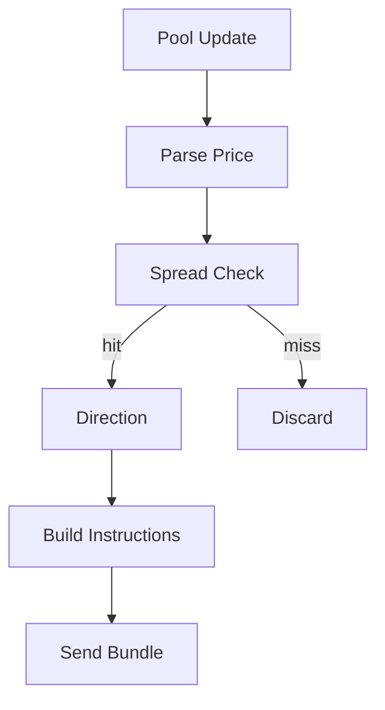

# Strategy：跨 DEX 套利策略（arb）

arb 策略在本项目中体现为“发现价差 → 决定方向 → 构造原子交易 → 发送 bundle”的闭环。当前实现以“Raydium vs Orca 的价格差”作为触发条件，并在发现机会时构造 Raydium swap + tip 的 bundle（Orca swap 构建目前仍缺 tick array 依赖，属于待补齐项）。

## 1. 模块功能说明

- 接收池账户更新（Raydium 或 Orca）。
- 解析价格：
  - Orca：从 `sqrt_price` 直接计算价格
  - Raydium：从 AMM 状态中读取缓存字段并计算价格（或通过 quote 模块读取 vault balance 进行更真实的报价）
- 计算价差：当 spread 超过阈值触发。
- 生成交易指令：构造 swap 指令、追加 tip 指令。
- 发送执行：将交易序列化为 base58，调用 Jito bundle 接口发送。



对应源码：

- `../../scavenger/src/strategies/arb.rs`

## 2. 技术实现细节

### 2.1 触发与方向

- 价差计算：`spread = abs(price_a - price_b) / min(price_a, price_b)`
- 方向选择：买低卖高（若 A < B，则买 A 卖 B，否则反之）

### 2.2 指令构造与限制

当前实现：

- Raydium swap：可构建（见 `arb.rs` 中 `build_raydium_swap_ix`）
- Orca swap：逻辑明确但缺 tick array/oracle 等账户补齐，暂时直接返回（见 `arb.rs` 的 warning）

因此现阶段“真实可执行的套利闭环”仍需补齐 Orca swap 的账户推导与 tick array 选择逻辑。

## 3. 关键算法和数据结构

- spread 判定与方向选择
- 原子交易指令列表：`Vec<Instruction>`（先 swap 再 tip）
- 交易序列化与 bundle payload（见执行模块）

## 4. 性能优化点

套利策略性能的关键瓶颈通常不在数学计算，而在：

- 报价获取（RPC/账户读取）：尽可能缓存或用 accountSubscribe 直接拿 data
- 构建指令所需的账户推导：预计算与缓存（如 ATA、PDA、tick arrays）
- 交易被包含概率：tip/priority fee 的动态调整（参考 `core/pricing.rs` 的利润/小费模型）

## 5. 可运行示例（价差判定 + 方向选择 + tip 计算）

下面示例演示一个“可运行的最小套利决策器”：输入两边价格与配置，输出方向与 tip（不依赖 Solana SDK）。

```python
from dataclasses import dataclass
from typing import Optional, Tuple

@dataclass(frozen=True)
class ProfitConfig:
    min_profit_sol: float = 0.01
    max_tip_sol: float = 0.1
    gas_cost_sol: float = 0.000005
    dynamic_tip_ratio: float = 0.5

def decide_arbitrage(
    price_a: float,
    price_b: float,
    input_sol: float,
    cfg: ProfitConfig,
) -> Optional[Tuple[str, float]]:
    # 输入：两边价格与投入资金；输出：方向与 tip（若满足净利润阈值）
    if price_a <= 0 or price_b <= 0:
        return None

    buy_on = "A" if price_a < price_b else "B"
    sell_on = "B" if buy_on == "A" else "A"

    gross_profit = input_sol * (abs(price_a - price_b) / min(price_a, price_b))
    potential_tip = gross_profit * cfg.dynamic_tip_ratio
    tip = min(potential_tip, cfg.max_tip_sol)
    net_profit = gross_profit - cfg.gas_cost_sol - tip

    if net_profit >= cfg.min_profit_sol:
        return (f"buy {buy_on} -> sell {sell_on}", tip)
    return None

if __name__ == "__main__":
    cfg = ProfitConfig()
    decision = decide_arbitrage(price_a=1.00, price_b=1.02, input_sol=1.0, cfg=cfg)
    print("decision:", decision)
```

## 6. 相关篇

- 上游（定价来源）：[AMM_定价与数学模型.md](./AMM_定价与数学模型.md)
- 下游（交易构建与 bundle 发送）：[Execution_原子交易与JitoBundle.md](./Execution_原子交易与JitoBundle.md)
- 风控（新币/权限检查）：[Risk_风控与安全检查.md](./Risk_风控与安全检查.md)
