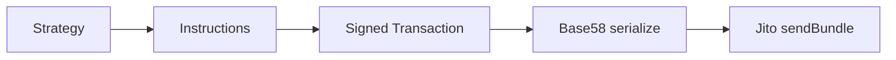

# Execution: Atomic Transactions and Jito Bundle

The execution layer is responsible for converting "strategy decisions" into "on-chain executable payloads". The core goals are:

- **Atomicity:** The arbitrage loop either fully succeeds or fully fails, preventing leg risk (partial execution).
- **Inclusion:** Maximizing the probability of the transaction being packed by the leader (via tip/priority fee, bundle channels).

## 1. Module Functionality Overview

- **Instruction Construction:**
  - Raydium swap instruction: `core/swap.rs`
  - Orca swap instruction (requires tick arrays): `core/swap.rs` / `core/orca.rs`
- **Atomic Transaction:** Assembling instruction list + tip instruction into a single transaction: `core/arbitrage.rs`
- **Bundle Sending:** Calling `sendBundle` via HTTP JSON-RPC: `core/jito_http.rs`



Corresponding Source Code:

- `../../scavenger/src/core/swap.rs`
- `../../scavenger/src/core/arbitrage.rs`
- `../../scavenger/src/core/jito_http.rs`

## 2. Technical Implementation Details

### 2.1 Relationship between Atomic Transaction and Bundle

On Solana:

- A **Transaction** can contain multiple instructions (multiple swaps + transfer tip).
- A **Bundle** is a collection of "multiple transactions" submitted to the block engine, usually providing stronger atomicity and ordering semantics (implementation depends on the specific engine).

The current strategy layer of this project typically puts "swap(s) + tip" into the same transaction, and then submits it as a bundle (containing only 1 tx in the bundle).

### 2.2 Jito sendBundle (HTTP JSON-RPC)

`core/jito_http.rs` serializes transactions into base58 string arrays and constructs the payload:

- `jsonrpc: "2.0"`
- `method: "sendBundle"`
- `params: [ [tx_base58_1, tx_base58_2, ...] ]`

Then POSTs to `https://mainnet.block-engine.jito.wtf/api/v1/bundles`.

## 3. Key Algorithms and Data Structures

- **Instruction Serialization:** Raydium swap instruction data layout is `[instruction_id|amount_in|min_out]` bytes.
- **Instruction Account Table:** The order of `Vec<AccountMeta>` must match what the on-chain program expects.
- **Atomic Transaction Builder:** Aggregates `Vec<Instruction>` and signs to generate `Transaction`.

## 4. Performance Optimization Points

- **Pre-calculating Accounts and PDAs:** Such as ATA, AMM authority, Serum vault signer, Orca tick arrays, etc., to avoid excessive RPC calls within the opportunity window.
- **Dynamic Tip and Circuit Breaking:** Adjusting tips dynamically based on the profit model in `core/pricing.rs`, while not exceeding `max_tip_sol`.

## 5. Runnable Example (Constructing sendBundle JSON-RPC payload)

This example does not send network requests, but only constructs the payload and prints it for local structural verification:

```python
import json
from dataclasses import dataclass
from typing import List

@dataclass(frozen=True)
class SendBundleRequest:
    txs_base58: List[str]

    def to_jsonrpc(self) -> dict:
        # Minimal JSON-RPC payload structure corresponding to sendBundle
        return {
            "jsonrpc": "2.0",
            "id": 1,
            "method": "sendBundle",
            "params": [self.txs_base58],
        }

if __name__ == "__main__":
    req = SendBundleRequest(txs_base58=["3Bxs...mockTx1", "4Cys...mockTx2"])
    print(json.dumps(req.to_jsonrpc(), indent=2))
```

## 6. Related Articles

- **Upstream (How strategy generates instructions):** [StrategyArb_Cross_DEX_Arbitrage_Strategy.md](./StrategyArb_Cross_DEX_Arbitrage_Strategy.md)
- **Risk Control (Whether execution is allowed):** [Risk_Risk_Control_and_Safety_Checks.md](./Risk_Risk_Control_and_Safety_Checks.md)
