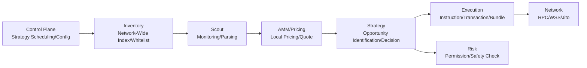

# Project: Module Breakdown Overview

This article provides the "Logical Module Breakdown" of the Solana MEV project in this repository, and maps each module to the source code directory and corresponding implementation documentation, facilitating citation as project-level breakdown documentation in blogs.

## 1. Module Breakdown (Logical Perspective)

Core Principles of Module Boundaries:

- **"Slow Path" should be asynchronous as much as possible:** RPC fetching, transaction parsing, and network requests are completed in background tasks or concurrent processes.
- **"Hot Path" should be local as much as possible:** Price calculation/quoting should be prioritized locally to reduce reliance on on-chain simulation.
- **"Monitoring Surface" should be minimized as much as possible:** Do inventory indexing first, then precise subscription, reducing invalid events.

## 2. Mapping Modules to Source Code (Engineering Perspective)

### 2.1 Control Plane (Python)

- **Function:** Strategy selection, configuration selection, starting Rust binary
- **Entry:** `commander/main.py`
- **Documentation:** [ControlPlane_Strategy_Scheduling_and_Configuration.md](./ControlPlane_Strategy_Scheduling_and_Configuration.md)

### 2.2 Inventory (Data Layer)

- **Function:** Building candidate arbitrage token/pool whitelist and monitoring list
- **Entry:** `scavenger/src/state.rs`, `scavenger/src/scout/api.rs`
- **Documentation:** [Inventory_Network_Wide_Token_Index.md](./Inventory_Network_Wide_Token_Index.md)

### 2.3 Scout (Reconnaissance Layer)

- **Function:** WebSocket monitoring (logs/account updates), parsing, and event dispatching
- **Entry:** `scavenger/src/scout/mod.rs`, `scavenger/src/scout/monitor.rs`
- **Documentation:** [Scout_Transaction_Monitoring_and_Parsing.md](./Scout_Transaction_Monitoring_and_Parsing.md)

### 2.4 AMM / Pricing (Pricing Layer)

- **Function:** Raydium CPMM quoting, local mathematical models; Orca Whirlpool price parsing (Q64.64)
- **Entry:** `scavenger/src/amm/*`, `scavenger/src/core/quote.rs`
- **Documentation:** [AMM_Pricing_and_Mathematical_Model.md](./AMM_Pricing_and_Mathematical_Model.md)

### 2.5 Strategy (Strategy Layer)

- **Function:** Opportunity identification, spread determination, direction selection, calling execution layer
- **Entry:** `scavenger/src/strategies/arb.rs`, `scavenger/src/strategies/sniper.rs`
- **Documentation:** [StrategyArb_Cross_DEX_Arbitrage_Strategy.md](./StrategyArb_Cross_DEX_Arbitrage_Strategy.md)

### 2.6 Execution (Execution Layer)

- **Function:** Constructing swap instructions, assembling atomic transactions, sending bundles
- **Entry:** `scavenger/src/core/{swap,arbitrage,jito_http}.rs`
- **Documentation:** [Execution_Atomic_Transaction_and_JitoBundle.md](./Execution_Atomic_Transaction_and_JitoBundle.md)

### 2.7 Risk (Risk Control Layer)

- **Function:** Token permission and tradability checks (freeze/mint authority)
- **Entry:** `scavenger/src/core/risk.rs`
- **Documentation:** [Risk_Risk_Control_and_Safety_Checks.md](./Risk_Risk_Control_and_Safety_Checks.md)

## 3. Recommended Reading Order

- Overview: [SolanaMEV_Technical_Analysis.md](./SolanaMEV_Technical_Analysis.md)
- Module Breakdown (This Article)
- Inventory → Scout → AMM → Strategy → Execution → Risk (In closed-loop order)
